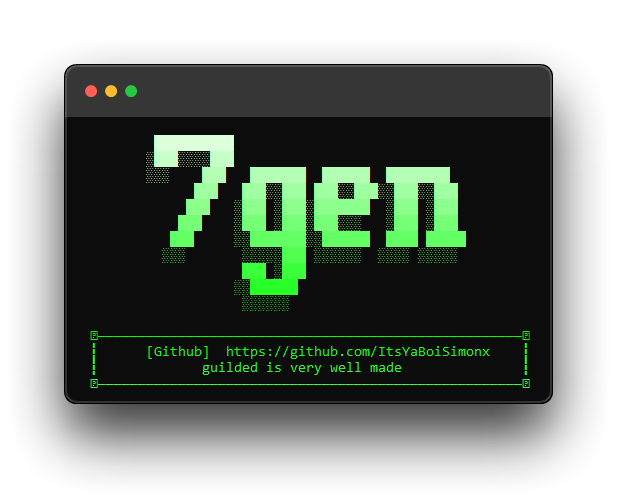

<h1 align="center">🎇 7-gen, a tool made to exploit guilded's bad account management system</h1>

<p align="center">
    
    
</p>

To run this program as intended, you'll need the newest version of python AND PIP downloaded off the official [python.org](https://www.python.org/downloads) website (both python and pip [added to path](https://www.youtube.com/watch?v=3a3UOSBffUI)) to run this correctly.

This tool is fully made in Python, it uses a hardcoded HTTPX client to create 7 accounts at the same time and spam messages to a set channel.

This tool works very well with [AutoTor](https://github.com/FDX100/Auto_Tor_IP_changer), which eliminates the need for proxies.

<h1 align="center">- USAGE -</h1>

Direct releases will be out very soon™, but as of right now, you can just ```git clone``` the repository and manually run it.

```
$ git clone https://github.com/ItsYaBoiSimonx/7-gen
```

* If you find ANY issues with this program after you've tried it yourself, don't be afraid to make a pull request or dm me on telegram, @StraightSW 🎉


<h1 align="center">- TODO -</h1>

* Add proxy support, desperately.
* Add an account manager (since, after you're done with the accounts, they're gonna be useless)
* "Humanizer" option (since, as of right now, the names are just random characters)

<p align="center">
  
</p>

<h3 align="center">
    ⌛ Just as an FYI, I am not responsible for anything you do with this project ⌛
    <br>
    Have fun with it, just not too much.
</h3>